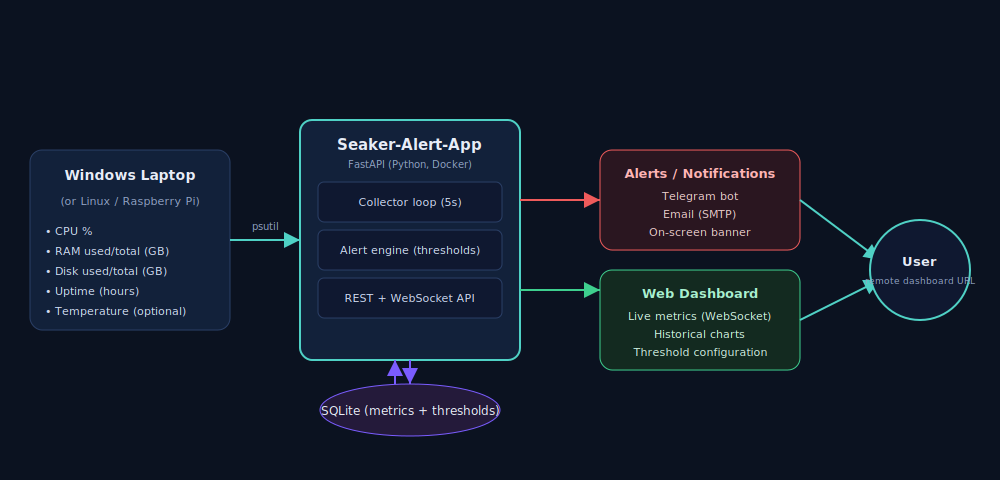

# Seaker-Alert-App

A system monitoring and alerting app built for the Seaker Jr. IoT Engineer assignment. It tracks CPU, RAM, Disk, uptime and temperature on a Windows/Linux machine, shows them live on a web dashboard, stores history in a database, and sends alerts (Telegram/email/on-screen) when a metric crosses a threshold you set.



## Features

- Live dashboard with CPU/RAM/Disk gauges and a historical chart (1h/24h/7d)
- Alerts via Telegram, email, and on-screen banner, with customizable thresholds
- Data stored in SQLite for history
- CSV/JSON export of historical data
- MQTT support for pushing metrics to other devices
- Basic role-based access: anyone can view, only an admin login can change thresholds (ADMIN_USERNAME=admin,ADMIN_PASSWORD=admin)
- Dockerized, and also available as a prebuilt image on Docker Hub
- Remote server using render URL- https://seaker-alert-app-t5pm.onrender.com

## Tech stack

Python, FastAPI, psutil, SQLite, WebSockets, Chart.js, Docker, Telegram Bot API, SMTP, MQTT

## Running it locally (Windows)

```powershell
git clone https://github.com/Thariq5113/Seaker-Alert-App 
cd Seaker-Alert-App

python -m venv venv
venv\Scripts\activate

pip install -r requirements.txt

copy .env.example .env

uvicorn app.main:app --host 0.0.0.0 --port 8000 --reload
```

Open http://localhost:8000

## Running it with Docker

Build it yourself:
```bash
git clone https://github.com/Thariq5113/Seaker-Alert-App
cd Seaker-Alert-App

cp .env.example .env
docker compose up --build
```

Or just pull the image I've already built and pushed to Docker Hub:
```bash
docker pull thariq7/seaker-alert-app:latest
docker run -p 8000:8000 --env-file .env thariq7/seaker-alert-app:latest
```
Docker Hub containing the image: https://hub.docker.com/r/thariq7/seaker-alert-app

Either way, open http://localhost:8000. Note: inside the container, the app reports the container's own resource usage, not the host machine's — this is expected Docker behaviour, not a bug.

## Setting up alerts

**Telegram** (easiest to demo):
1. I've already set up a bot for this project — you can message it directly at https://t.me/SeakerAlertBot
2. If you want to use your own bot instead: message `@BotFather` on Telegram → `/newbot` → copy the token it gives you
3. Message your bot once (so it's allowed to reply to you)
4. Visit `https://api.telegram.org/bot<TOKEN>/getUpdates` and copy the `chat id` you see
5. In `.env`:
   ```
   TELEGRAM_ENABLED=true
   TELEGRAM_BOT_TOKEN=<token>
   TELEGRAM_CHAT_ID=<chat id>
   ```

**Email** (Gmail):
1. Turn on 2-Step Verification on your Google account
2. Generate an App Password at https://myaccount.google.com/apppasswords
3. In `.env`:
   ```
   EMAIL_ENABLED=true
   SMTP_USER=your_gmail@gmail.com
   SMTP_PASSWORD=<app password, no spaces>
   ALERT_EMAIL_TO=where_alerts_should_go@gmail.com
   ```

**MQTT** (optional, needs a broker like Mosquitto running):
```
MQTT_ENABLED=true
MQTT_BROKER_HOST=localhost
MQTT_TOPIC=seaker/metrics
```

Restart the app after changing `.env` for any of these to take effect.

## Changing thresholds

Edit them directly from the dashboard under "Alert Thresholds." Saving requires an admin login — your browser will prompt for it. Set the admin username/password in `.env`:
```
ADMIN_USERNAME=admin
ADMIN_PASSWORD=admin
```

Default thresholds used to trigger alerts:

| Metric | Default |
|---|---|
| CPU % | 85 |
| RAM % | 85 |
| Disk % | 90 |
| Temperature °C | NA |

To simulate an alert for a demo: just lower a threshold below the current value on the dashboard and save — the alert fires within a few seconds.

## Live demo

Dashboard: https://seaker-alert-app-t5pm.onrender.com

## A few things I focused on while building this

I didn't want this to just be psutil numbers dumped on a page, so I spent extra time on a few things:

- **The dashboard updates in real time over a WebSocket**, not by refreshing the page every few seconds. Open it and watch the gauges move as your CPU load changes.
- **Alerts actually go out on three channels** — Telegram, email, and an on-screen banner — and I added a cooldown so the same alert doesn't spam you every few seconds while a metric stays high.
- **Thresholds are editable from the dashboard itself**, no need to touch config files, but I locked that down behind a login so it's not just wide open to anyone with the link.
- I went with a plain **FastAPI + SQLite** setup instead of the TICK stack option mentioned in the brief. I wanted to actually build the collection, storage, and alerting logic myself rather than just configuring existing tools together — felt like a better way to show what I can build, not just what I can wire up.
- Temperature shows **N/A on Windows** — that's not a bug, Windows just doesn't expose it through psutil the way Linux does, which is also why the brief lists it as optional.
- The image and history charts, gauges, and layout are all custom, no templates — I wanted the dashboard to actually look like something someone would want to check, not just raw numbers in a table.
